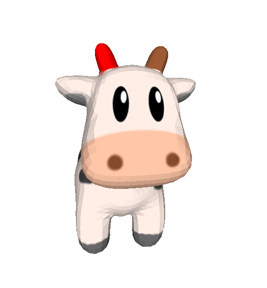
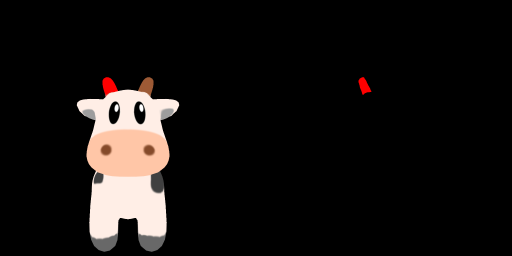
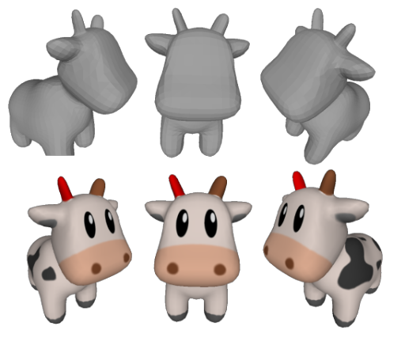

# Paint Mesh Editing

__PME (Paint Mesh Editing) project__ is aim to deform mesh with 2D image guidance.

## Overview
When we have a mesh, and we paint some part of this mesh into a color (or we call label). With such color label, we can render the mesh and find the rendered label in 2D image. Finally, we use the same color (label) to edit the 2D rendered image, with PME we could adjust the origin mesh easily!

Here we show an example, the right horn of cow is being painted red as shown in the following image.



In the rendered view, we thinner the red label, which means we want to make the right horn of cow to be thinner.



Then, the mask image is the union of the rendered label and painted label. Now we can use PME to editing the origin mesh vertex position to fit the target. As shown in the following image.



## Dependencies
* pytorch
* torchvision
* numpy
* opencv-python
* tqdm
* nvdiffrast

## About render
Only unlit rendering is supported. For the renderer implemented in this project, one is easy to render color, depth and mask with given mesh, intrinsic (4x4) and extrinsic (4x4).

```python

    args = {
        # global params
        'device' : 'cuda',
        'rastype': 'opengl',

        # rasterization settings
        'render_size': (1024, 1024), # H x W
        }


    mesh = load_obj(mesh_path, texture_path, 'cuda')

    renderer = NvdiffrastMeshUlitRenderer(args)
    renderer.set_camera_intrinsic(intrinsic)
    renderer.set_camera_extrinsic(extrinsic)

    mask, depth, image = renderer(mesh)


```

## Speed
For the given sample, in RTX 3070 each optimization step costs less than one minute.


## TODOs

* GUI support
* Automatic loss adaptation
* Support more than label constrain, e.g. normal map constrain
* More loss function
* Combination of other AI model for 2D image editing
* ...